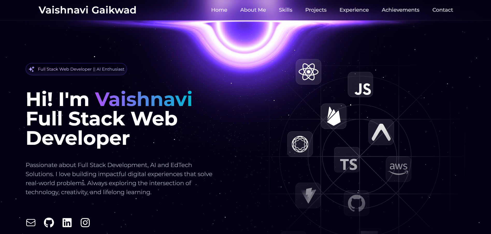

# 🌐 Personal Portfolio Website

This is my personal portfolio website showcasing my skills, projects, achievements, and professional journey as a developer.

## 🌍 Live Demo

🚀 **Deployed on Vercel:**

<p align="center">
  
</p>

🔗 https://vaishnavigaikwadportfolio.vercel.app/

## ✨ Features

- Responsive and modern UI
- Smooth animations and transitions
- Dedicated sections for About, Skills, Projects, Experience, and Achievements
- Clean and accessible design
- Optimized for performance

## 🛠️ Tech Stack

- HTML5, CSS3, JavaScript
- React / Next.js
- Tailwind CSS
- Framer Motion

## 📂 Sections Included

- Home
- About Me
- Skills
- Projects
- Work Experience
- Achievements & Certifications
- Contact

## 🚀 Getting Started

To run the project locally:

```bash
git clone <your-repo-url>
cd portfolio
npm install
npm run dev
```
